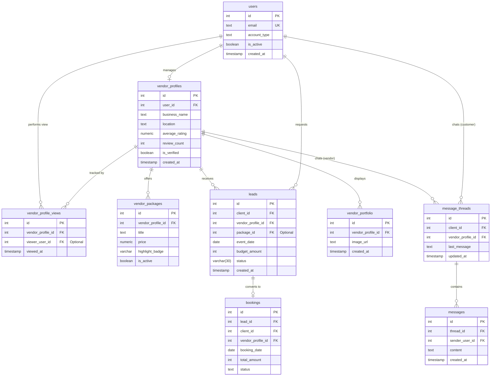

# Final Production Database ERD (Enriched Lean Version)

This Entity-Relationship Diagram represents the complete, verified production schema. We have specifically ensured that **Vendor Profile Views** are integrated into the core tracking system.

